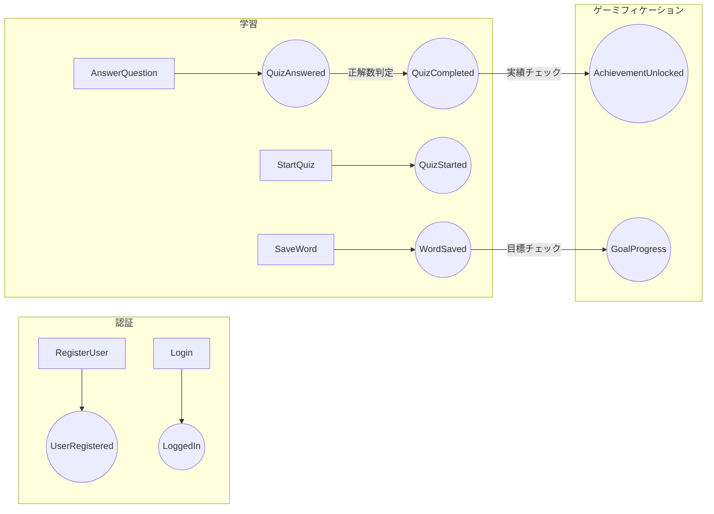

# ドメインモデリング（イベントストーミング）

## 目的

要件分析とアーキテクチャ設計の間で、**AI側がイベントストーミングを実施**し、
ドメインの構造を可視化してユーザーに確認させる。

## いつ実行するか

- バックエンドがある場合は必須
- CRUD以上の業務ロジックがある場合は特に重要
- ステージ5（アーキテクチャ設計）の前に実施

## 実施手順

### 1. ドメインイベントの洗い出し

要件から「システム内で起きること」を過去形で列挙する:

```
例:
- ユーザーが登録された (UserRegistered)
- 単語が保存された (WordSaved)
- クイズが開始された (QuizStarted)
- クイズが回答された (QuizAnswered)
- 学習目標が達成された (GoalAchieved)
```

### 2. コマンドの特定

各イベントを引き起こす「アクション」を特定:

```
コマンド → イベント
RegisterUser → UserRegistered
SaveWord → WordSaved
StartQuiz → QuizStarted
AnswerQuestion → QuizAnswered
```

### 3. 集約（Aggregate）の特定

関連するイベントとコマンドをグループ化し、整合性の境界を決める:

```
[User集約]
  - RegisterUser → UserRegistered
  - UpdateProfile → ProfileUpdated
  - DeleteAccount → AccountDeleted

[Vocabulary集約]
  - SaveWord → WordSaved
  - DeleteWord → WordDeleted
  - SavePhrase → PhraseSaved

[Quiz集約]
  - StartQuiz → QuizStarted
  - AnswerQuestion → QuizAnswered
  - CompleteQuiz → QuizCompleted
```

### 4. 境界づけられたコンテキスト（Bounded Context）の決定

集約をさらにグループ化し、マイクロサービスやモジュールの境界を決める:

```
[認証コンテキスト]
  └── User集約

[学習コンテキスト]
  ├── Vocabulary集約
  └── Quiz集約

[ゲーミフィケーションコンテキスト]
  ├── Achievement集約
  └── Goal集約
```

### 5. ドメインイベントフロー図の作成

mermaid で可視化:



### 6. HTML成果物の生成

`aidlc-docs/inception/design/event-storming.html` を生成:

```html
<!DOCTYPE html>
<html lang="ja"><head>
<meta charset="UTF-8">
<title>Event Storming - ドメインモデル</title>
<style>
  body { font-family: system-ui; max-width: 1400px; margin: 0 auto; padding: 2rem; background: #0d1117; color: #e6edf3; }
  .board { display: flex; gap: 2rem; flex-wrap: wrap; }
  .context { border: 2px solid #30363d; border-radius: 12px; padding: 1.5rem; min-width: 300px; flex: 1; }
  .context-name { font-size: 1.2rem; font-weight: bold; margin-bottom: 1rem; color: #58a6ff; }
  .aggregate { background: #161b22; border: 1px solid #30363d; border-radius: 8px; padding: 1rem; margin-bottom: 1rem; }
  .aggregate-name { font-weight: bold; color: #f0883e; margin-bottom: 0.5rem; }
  .event { display: inline-block; background: #f97316; color: #000; padding: 0.3rem 0.8rem; border-radius: 4px; margin: 0.2rem; font-size: 0.85rem; }
  .command { display: inline-block; background: #3b82f6; color: #fff; padding: 0.3rem 0.8rem; border-radius: 4px; margin: 0.2rem; font-size: 0.85rem; }
  .flow { margin-top: 2rem; padding: 1.5rem; border: 2px solid #30363d; border-radius: 12px; }
  .flow-title { font-size: 1.1rem; font-weight: bold; color: #58a6ff; margin-bottom: 1rem; }
  .flow-step { display: flex; align-items: center; gap: 0.5rem; margin: 0.5rem 0; }
  .arrow { color: #6e7681; }
  h1 { color: #58a6ff; }
  .legend { display: flex; gap: 1.5rem; margin-bottom: 2rem; padding: 1rem; background: #161b22; border-radius: 8px; }
  .legend-item { display: flex; align-items: center; gap: 0.5rem; }
</style>
</head><body>
<h1>🎯 Event Storming</h1>
<div class="legend">
  <div class="legend-item"><span class="command">Command</span> アクション</div>
  <div class="legend-item"><span class="event">Event</span> 結果</div>
</div>
<div class="board">
  <!-- 各コンテキスト・集約・イベント・コマンドをここに展開 -->
</div>
<div class="flow">
  <div class="flow-title">主要フロー</div>
  <!-- ユーザーの主要操作フローを時系列で表示 -->
</div>
</body></html>
```

## ユーザーへの提示

1. HTML成果物を生成
2. 「`event-storming.html` をブラウザで開いて確認してください」と案内
3. 以下を質問:
   - コンテキストの分割は適切か（分けすぎ/まとめすぎ）
   - 見落としているイベントはないか
   - イベント間の因果関係は正しいか
   - 集約の境界は自然か
4. フィードバックを受けて修正
5. 承認を得る

## 後続への影響

承認されたドメインモデルは:
- **ディレクトリ構成**に直結（コンテキスト → モジュール/ディレクトリ）
- **DB設計**の集約境界になる（集約 = トランザクション境界）
- **API設計**のリソース分割になる（集約 ≒ APIリソース）
- **issue分割**の単位になる（集約ごとに垂直スライス）

```
src/
  domain/
    auth/          ← 認証コンテキスト
      user.ts
    learning/      ← 学習コンテキスト
      vocabulary.ts
      quiz.ts
    gamification/  ← ゲーミフィケーションコンテキスト
      achievement.ts
      goal.ts
```

## アンチパターン

- ❌ CRUDだけでイベントを考える（「保存された」だけでなく業務的な意味を考える）
- ❌ 技術的な関心事をドメインに混ぜる（「DBに書き込まれた」はイベントではない）
- ❌ 全部1つのコンテキストにまとめる（境界を引かないとモノリスになる）
- ❌ コンテキストを細かく分けすぎる（CRUD程度なら1コンテキストで十分）
